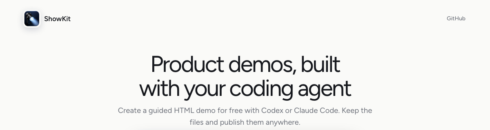

<p align="center">
  
</p>

<h1 align="center">ShowKit</h1>

<p align="center">Turn a product flow into a guided interactive HTML demo.</p>

<p align="center">
  <a href="https://github.com/hyunghwan/showkit/actions/workflows/ci.yml"></a> ·
  <a href="https://showkit.sqncs.com">Website</a> ·
  <a href="https://hyunghwan.github.io/showkit/">Live demos</a> ·
  <a href="GETTING_STARTED.md">Getting started</a> ·
  <a href="ARCHITECTURE.md">Architecture</a> ·
  <a href="SECURITY.md">Security</a> ·
  <a href="SUPPORT.md">Support</a> ·
  <a href="CONTRIBUTING.md">Contributing</a> ·
  <a href="LICENSE">MIT License</a>
</p>

ShowKit is an open-source toolkit for coding agents. It preserves supported
HTML, text, styles, and local assets, then builds a portable demo with hotspots
and tooltips. The result is interactive HTML, not a screenshot tour.

> [!NOTE]
> The ShowKit CLI is published as `@showkit/cli`. The ShowKit skill and CLI are
> separate installs: adding the skill does not change project dependencies,
> and the skill asks before it adds the CLI to an existing project.

<p align="center">
  <a href="https://showkit.sqncs.com">
    
  </a>
</p>

<p align="center"><em>Explore the Airbnb, Linear, and Stripe demos on the <a href="https://hyunghwan.github.io/showkit/">public demo gallery</a>.</em></p>

The [checked product-insights example](examples/product-insights/) uses only
synthetic content. The public repository's Pages workflow publishes a gallery
that presents the same three demos as the ShowKit website. Those published
demos stay on `showkit.sqncs.com`, so their captured third-party assets are not
vendored under this repository's MIT license.

## Quick start

### Install and create your first demo

Requirements: Node.js 22 or 24.

Open Claude Code or Codex and paste this. Your coding agent does the rest.

> Install ShowKit and create a checked local interactive HTML demo of the
> product flow I have open. First run `npx skills add hyunghwan/showkit`, then
> find and read the installed ShowKit `SKILL.md` and follow it. Choose the number
> of steps this flow needs. Preserve supported visible HTML, text, styles, and
> local assets. Never use screenshots. Stop before saving if private content
> needs my choice. Set up a compatible `@showkit/cli` in a new output folder.
> Ask before changing an existing project's dependencies or installing
> Playwright or a browser. Build, check, and preview the demo locally. Do not
> publish anything. When you finish, give me the local preview path and a short
> summary of what ShowKit checked.

The skill handles setup, installs a compatible `@showkit/cli` runtime in the
output folder, selects the safest available capture route, checks the demo, and
returns the local preview path. It asks before changing an existing project's
dependencies or installing optional Playwright and its browser binary.

The portable skill is documented for Codex, ChatGPT, Claude Code, and the
Claude Desktop Code tab. Automated installation tests cover Codex and Claude
Code; app browser routes still have to pass their installed capability checks.
A local preview is not published.

For a guided first run and a clear explanation of each lifecycle state, read
[`GETTING_STARTED.md`](GETTING_STARTED.md).

### Try another prompt

From a checked-in app or static build:

> Use ShowKit's static-source route to create a local interactive demo of this
> onboarding flow. Use the number of steps the flow needs and report the result
> as source-derived.

From a repeatable Playwright flow:

> Use ShowKit to turn this Playwright flow into a checked interactive demo that
> we can regenerate in CI. Install the optional Playwright dependency only if it
> is missing and I approve the change.

To update an existing demo:

> Rebuild this ShowKit demo from the current product flow, compare it with the
> previous version, and report what changed. Keep the result local.

## What you can build

- Product onboarding and feature walkthroughs
- Release previews and launch demos
- Sales and customer-success product tours
- Repeatable demos generated from Playwright flows
- Portable HTML demos for any static host
- Optional Markdown release notes from the same captured evidence

## Capture routes

| Source | Best for | Extra dependency |
| --- | --- | --- |
| Verified ChatGPT or Codex Browser/Chrome | A supported signed-in product page | None in the output project |
| Static source | A codebase or checked-in HTML/CSS build | None |
| Isolated Playwright | A temporary headed browser or repeatable CI flow | Optional `@playwright/test` |

Browser-session capture continues only after the installed host passes
ShowKit's isolated, read-only check. Claude's built-in browser route is not used
when that isolation cannot be verified; use static source or approve a separate
temporary Playwright browser instead.

Choose the number of steps that explains the flow. Five steps may be useful in
an example, but ShowKit does not pad or truncate every demo to a fixed count.
The bounded browser-session route accepts 3–7 ordered states; static-source and
Playwright flows may be shorter or longer.

## What ShowKit keeps out

ShowKit does not persist cookies, headers, passwords, tokens, browser storage,
raw DOM, request or response bodies, or remote asset URLs. It stops before
saving detected private data, unsupported visual surfaces, unsafe remote
assets, or a full-scene screenshot fallback.

A blocked capture leaves secret-free diagnostics and does not replace the
previous demo. Passing ShowKit checks is not a security, compliance, or
accessibility certification. Read [`SECURITY.md`](SECURITY.md) for the complete
trust boundary.

## Output

ShowKit builds selectable, semantic HTML with local content-addressed assets,
DOM-anchored hotspots, tooltips, keyboard navigation, progress, Back, Next, and
Restart demo. A small `Powered by ShowKit` link sits below the interactive
player layers in the bottom-right and opens the ShowKit website in a new tab.
The same captured input produces the same artifact hash.

Generated files live under `.showkit/artifacts/<content-hash>/`. Copy the whole
directory to a static host when you are ready to publish it separately.

## Manual CLI use

Most people can let the skill handle this. For a project-authored workflow:

```bash
npm install -D @showkit/cli
npx showkit doctor --json
npx showkit init --json
```

Add Playwright only for an approved headed-browser or CI flow:

```bash
npm install -D @playwright/test
npx playwright install chromium
npx showkit doctor --capability playwright --json
```

The package exposes the `showkit` command, typed contracts from
`@showkit/cli`, the optional `@showkit/cli/playwright` fixture, and generated
JSON Schemas. See [`packages/cli/README.md`](packages/cli/README.md) for the
package reference.

## Documentation

- [`GETTING_STARTED.md`](GETTING_STARTED.md): build and inspect a first local demo
- [`ARCHITECTURE.md`](ARCHITECTURE.md): understand the deterministic pipeline and trust boundary
- [`packages/cli/README.md`](packages/cli/README.md): CLI, package exports, schemas, and exit codes
- [`COMPATIBILITY.md`](COMPATIBILITY.md): supported Node.js, browser, skill, and schema versions
- [`SECURITY.md`](SECURITY.md): safe-use boundary and private vulnerability reporting
- [`SUPPORT.md`](SUPPORT.md): questions, bug reports, and useful diagnostics
- [`CHANGELOG.md`](CHANGELOG.md): release history

## Development

```bash
corepack pnpm install --frozen-lockfile
pnpm exec playwright install chromium
pnpm docs:check
pnpm check
pnpm build
pnpm test
```

Read [`CONTRIBUTING.md`](CONTRIBUTING.md) and the
[`CODE_OF_CONDUCT.md`](CODE_OF_CONDUCT.md) before opening a pull request.

## License

ShowKit is available under the [MIT License](LICENSE). Dependency license
details are in [`THIRD_PARTY_NOTICES.md`](THIRD_PARTY_NOTICES.md).
